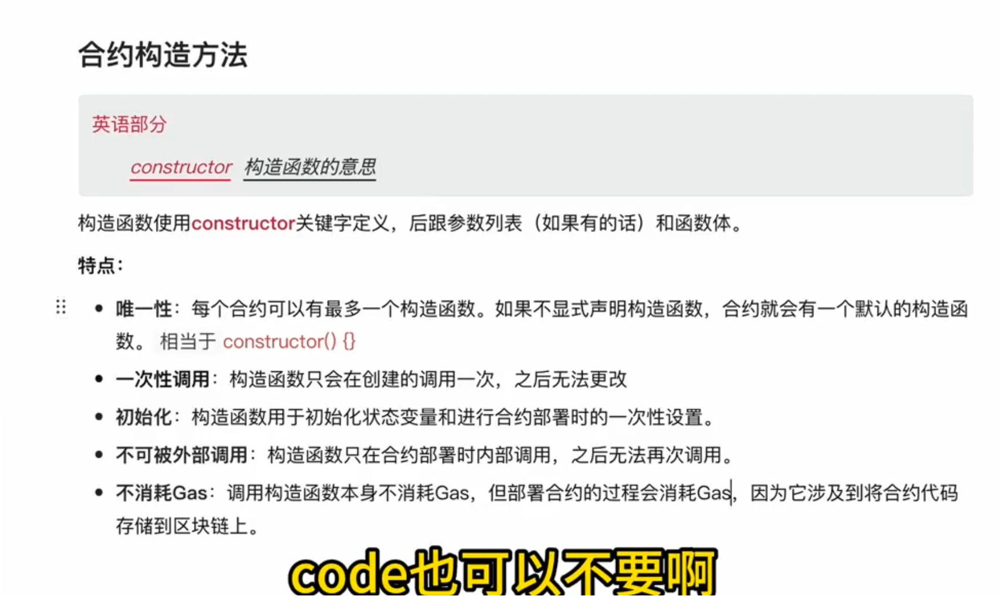
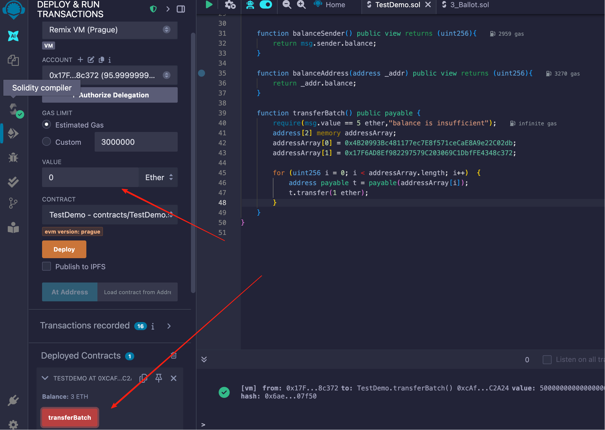
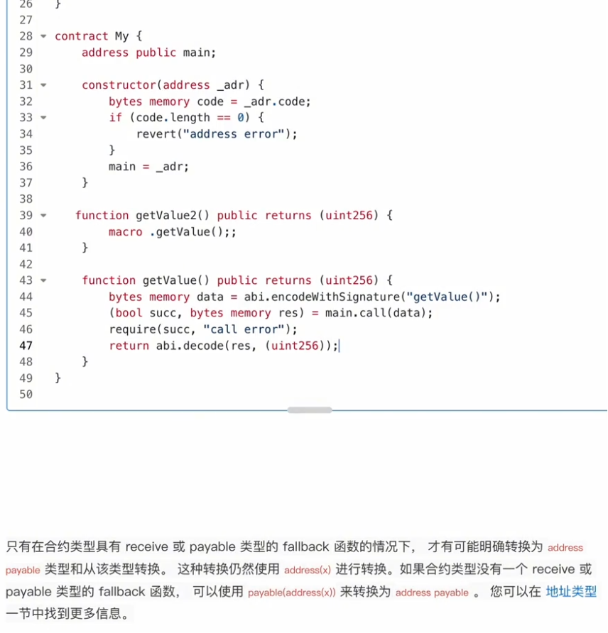
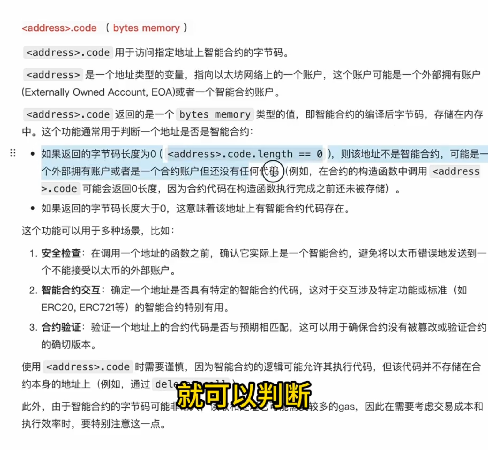

# 基础语法

- [基础语法](#基础语法)
  - [数据类型](#数据类型)
    - [字符串类型](#字符串类型)
    - [定长字节数据 bytes](#定长字节数据-bytes)
  - [合约的构造函数](#合约的构造函数)
  - [地址类型](#地址类型)
  - [合约的初始化方式](#合约的初始化方式)
  - [合约类型](#合约类型)
    - [隐式转换](#隐式转换)
    - [显示转换](#显示转换)
    - [code](#code)
  - [低级 call 调用](#低级-call-调用)
    - [call的远程调用](#call的远程调用)
    - [使用call进行转账](#使用call进行转账)
  - [合约接收转账](#合约接收转账)

## 数据类型

solidity的数据结构主要包括：值类型、引用类型、映射类型等

其中：

值类型包括：

1. 布尔类型
2. 整数
3. 地址
4. 枚举

引用类型包括：

1. 数据存储位置
2. 数组
3. 数组切片
4. 结构体

### 字符串类型

Solidity语言对字符串的内置操作支持非常有限。

由于字符串是动态大小的数据类型，处理（拼接、切片、比较）他们通常比处理固定大小的数据类型更复杂和更昂贵。

例如：字符串的拼接需要创建一个新的动态数组来存储结果，这个过程涉及到内存分配和多次的复制操作，每一步都会消耗gas，在寸土寸金的以太坊网络，处理字符串是多么的昂贵。

优化建议：

1. 对于复杂的字符串操作，考虑在应用层（JS、golang、python层处理），而不是在智能合约层处理
2. 对于不需要永久存储在区块链上的数据，可以考虑使用memory、calldata类型存储，减少存储成本
3. 在智能合约中处理字符串可能会消耗更多的gas，特别是字符串作为参数或者需要存储在区块链上时

总的来说：solidity可以处理字符串，但是应该谨慎操作，避免不必要的高成本。


```solidity
// SPDX-License-Identifier: GPL-3.0

pragma solidity >=0.7.0 <0.9.0;

contract TestDemo {
    string a = "hello";
    string b = "world";

    string c = unicode"你好";

    function name() public view returns (string memory) {
        return c;
    }

    //字符串拼接
    function stringConcat() public view returns (string memory) {
        return string(abi.encodePacked(a, " ", b));
    }

    //字符串长度：计算ASCII码的长度
    function stringLength() public view returns (uint256) {
        return bytes(a).length;
    }

    //字符串相等
    function stringEquals() public view returns (bool) {
        return keccak256(abi.encodePacked(a)) == keccak256(abi.encodePacked(b));
    }
}


```

### 定长字节数据 bytes

byte是从0~255的无符号类型

举例：

- bytes1 a = 0x01;表示计算机二进制的8 位
- bytes32;表示计算机二进制的8*32位，也就是256位

对于更大或者变长的字节数据，可以使用 bytes[] 类型，他是一个动态大小的字节数组，可以存储任意长度的字节数据。

与bytes1[](字节的动态数组)相比，bytes 类型在内存使用和 gas 消耗上更加高效。


## 合约的构造函数

构造函数所需要的参数，在部署合约的时候需要给出！



## 地址类型

地址转换

成员变量和函数

使用方式

单位

批量转账-实战

```solidity

//获取调用者的余额
function balanceSender() public view returns (uint256){
    return msg.sender.balance;
}

//获取指定地址的余额
function balanceAddress(address _addr) public view returns (uint256){
     return _addr.balance;
}

    //批量转账
    function transferBatch() public payable {
        require(msg.value == 2 ether,"balance is insufficient");
        address[2] memory addressArray;
        addressArray[0] = 0x4B20993Bc481177ec7E8f571ceCaE8A9e22C02db;
        addressArray[1] = 0x17F6AD8Ef982297579C203069C1DbfFE4348c372;

        for (uint256 i = 0; i < addressArray.length; i++)  {
            address payable t = payable(addressArray[i]);
            //向地址转账1ether
            t.transfer(1 ether);
        }
    }
```




## 合约的初始化方式

1. 构造函数
2. new

## 合约类型

1. 合约隐式转换
2. 合约显示转换

### 隐式转换

合约继承关键字：is

每个合约都有自己的类型，一个合约可以隐式的转换为它所继承的合约类型。

### 显示转换

合约可以显示的转换为address 类型，也可以从address转换为合约类型。



### code

address.code 用于访问指定地址上智能合约的字节码

1. 获取合约的code



## 低级 call 调用

1. call的远程调用
2. 使用call进行转账

### call的远程调用

### 使用call进行转账


## 合约接收转账

